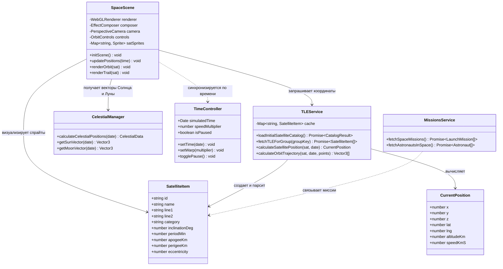
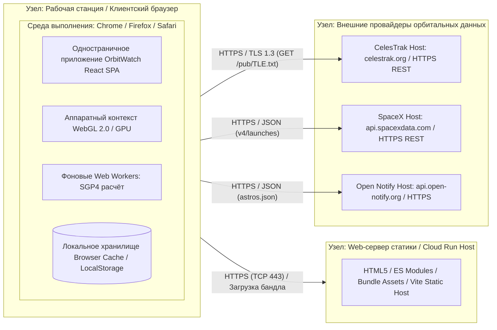
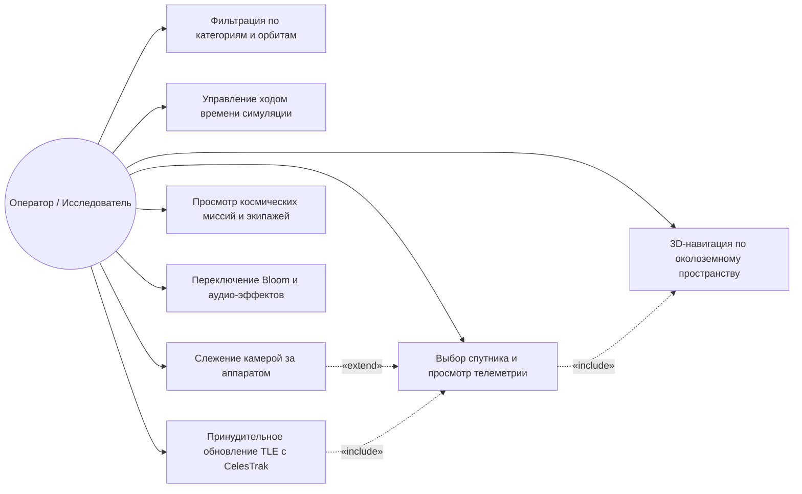
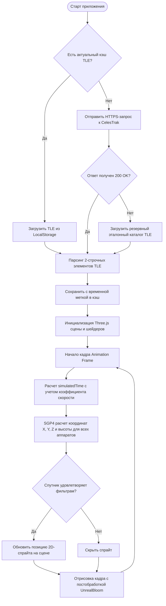
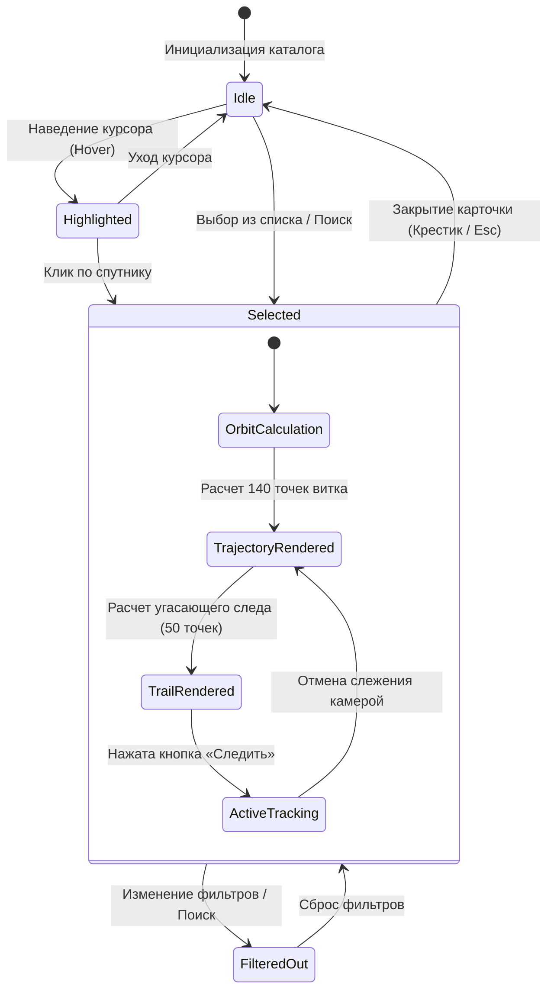
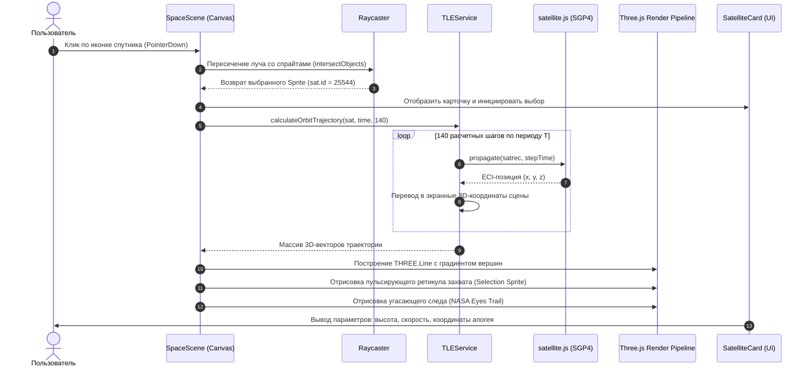
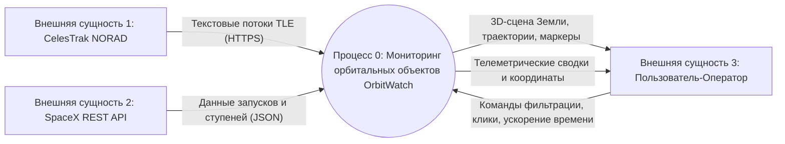

# Обзор архитектурных и функциональных диаграмм проекта «OrbitWatch»

**Тема проекта:** «Веб-приложение для 3D-визуализации космических миссий и отслеживания спутников в реальном времени OrbitWatch»  
**Дисциплина:** ПМ.02 «Осуществление интеграции программных модулей»  
**Образовательное учреждение:** ГБПОУ НСО «НЭК», 2026 г.

---

## 1. Введение

Веб-приложение **OrbitWatch** представляет собой интерактивный аппаратно-программный комплекс реального времени для мониторинга околоземного космического пространства. Проект решает задачу интеграции разнородных внешних источников данных (CelesTrak NORAD, SpaceX API, Open Notify), математического аппарата небесной механики (модели возмущений SGP4/SDP4 библиотеки `satellite.js`) и высокопроизводительного графического 3D-движка (WebGL / Three.js) в единую клиентскую распределенную систему.

---

## 2. Структурные диаграммы

### 2.1. Диаграмма классов (Class Diagram)
**Назначение:** Описание логической объектно-ориентированной структуры приложения, распределения обязанностей, типов атрибутов и методов.



**Обоснование решений:**
Выделение специализированного сервиса `TLEService` изолирует математический аппарат SGP4 от логики представления `SpaceScene`. Класс `CelestialManager` инкапсулирует расчёт эфемерид Солнца и Луны, что позволило реализовать физически корректную смену дня/ночи и терминатора без перегрузки сцены.

---

### 2.2. Диаграмма компонентов (Component Diagram)
**Назначение:** Описание модульной архитектуры программного обеспечения, предоставления и использования интерфейсов.

```mermaid
graph TD
    subgraph UI_Layer [Уровень представления (React 19 & Tailwind CSS)]
        Header[Header Toolbar]
        FilterBar[Filter & Search Bar]
        SatCard[Satellite Telemetry Card]
        TimeCtrl[Time Warp Controller]
        MissionsUI[Missions & Crew Modal]
        Drawer[Satellite Catalog Drawer]
    end

    subgraph Graphics_Layer [Графический 3D-уровень (Three.js WebGL)]
        SpaceSceneComp[SpaceScene Engine]
        ShaderPass[Atmosphere & Day/Night Shaders]
        BloomPass[UnrealBloom Post-processing]
        SpriteRenderer[Procedural Sprite Generator]
    end

    subgraph Logic_Layer [Уровень бизнес-логики и физики]
        SGP4Engine[SGP4/SDP4 Orbit Propagator]
        AstroEngine[Astronomical Coordinates Engine]
        AudioEngine[Web Audio Sound Synthesizer]
    end

    subgraph Data_Layer [Уровень данных и интеграции]
        TLEServiceComp[TLE Fetcher & Parser]
        CacheStore[LocalStorage & Memory Cache]
        MissionsServiceComp[SpaceX & Crew REST Client]
    end

    subgraph External_APIs [Внешние сервисы]
        CelesTrak[CelesTrak NORAD API]
        SpaceXAPI[SpaceX REST API]
        OpenNotify[Open Notify ISS Crew API]
    end

    UI_Layer --> Graphics_Layer
    UI_Layer --> Logic_Layer
    Graphics_Layer --> Logic_Layer
    Logic_Layer --> Data_Layer
    Data_Layer --> External_APIs
    TLEServiceComp <--> CacheStore
```

**Обоснование решений:**
Разделение на 4 независимых слоя (UI, 3D Graphics, Logic, Data) обеспечивает слабую связанность (low coupling) и высокую связность (high cohesion). При сбое внешних API слой данных прозрачно переключается на локальный кэш и встроенные эталонные TLE-данные, сохраняя полную работоспособность приложения.

---

### 2.3. Диаграмма развертывания (Deployment Diagram)
**Назначение:** Физическое размещение компонентов программной системы на аппаратных узлах и спецификация протоколов передачи данных.



**Обоснование решений:**
Архитектура «Client-heavy SPA» с прямым обращением к защищенным HTTPS-эндпоинтам снижает задержки (latency) и исключает нагрузку на промежуточный бэкенд. Все 3D-вычисления и интегрирование орбит производятся непосредственно на GPU и многоядерном CPU пользователя.

---

## 3. Поведенческие диаграммы

### 3.1. Диаграмма вариантов использования (Use Case Diagram)
**Назначение:** Описание функциональных возможностей системы с точки зрения конечного пользователя (оператора/исследователя).



---

### 3.2. Диаграмма деятельности (Activity Diagram)
**Назначение:** Описание алгоритмического процесса инициализации, загрузки TLE-данных и циклического рендеринга спутниковой группировки.



---

### 3.3. Диаграмма состояний (State Machine Diagram)
**Назначение:** Моделирование жизненного цикла выбранного спутника и состояний системы сопровождения цели.



---

### 3.4. Диаграмма последовательности (Sequence Diagram)
**Назначение:** Детализация хронологического порядка взаимодействия объектов при выборе космического аппарата и построении его траектории.



---

## 4. Функциональные диаграммы

### 4.1. IDEF0 A-0 (Контекстная диаграмма)
**Назначение:** Определение контекстных границ системы OrbitWatch, целевой функции, внешних регламентов, механизмов и потоков.

```
                  УПРАВЛЕНИЕ (C)
  [Законы орбитальной механики Кеплера] 
  [Стандарты SGP4/SDP4] [Настройки фильтрации пользователя]
                          │
                          ▼
            ┌───────────────────────────┐
ВХОДЫ (I)   │                           │ ВЫХОДЫ (O)
───────────►│  Визуализировать орбиты  ├────────────►
[Двухстроч- │    и космические миссии   │ [3D-глобус с аппаратами]
 ные TLE]   │      в реальном времени   │ [Векторы движения и следы]
[Системное  │                           │ [Телеметрия: V, H, Lat/Lng]
 время UTC] │        (Блок А-0)         │ [Каталог экипажей и запусков]
[API-ответы]│                           │
            └─────────────┬─────────────┘
                          ▲
                          │
                     МЕХАНИЗМЫ (M)
  [Браузерный движок WebGL 2.0] [Библиотека satellite.js]
  [Среда React 19 / Three.js]   [Пользователь / Оператор]
```

- **Входы (Inputs):** Необработанные TLE строки спутниковых группировок, системное время, данные JSON запусков SpaceX и экипажа МКС.
- **Управление (Controls):** Аналитическая теория возмущений SGP4, константы WGS-84, пользовательские параметры временного ускорения (warp) и фильтрации.
- **Выходы (Outputs):** Графическая 3D-модель движения спутников, траектории витков, карточка телеметрии, уведомления (Toast).
- **Механизмы (Mechanisms):** Видеокарта (GPU/WebGL), процессор (JavaScript V8/Web Workers), Three.js, конечный пользователь.

---

### 4.2. IDEF0 A0 (Функциональная декомпозиция первого уровня)
**Назначение:** Детализация главной функции на 4 взаимосвязанных подпроцесса.

```
                   [Входные TLE и API]
                           │
                           ▼
          ┌───────────────────────────────────┐
          │ А1. Загрузка, кэширование         │
          │     и парсинг орбитальных данных  │
          └────────────────┬──────────────────┘
                           │ Распарсенные satrec записи
                           ▼
          ┌───────────────────────────────────┐
          │ А2. Аналитический SGP4-расчет     │◄── [Шкала времени UTC]
          │     координат, скорости и высоты  │
          └────────────────┬──────────────────┘
                           │ 3D-координаты (x, y, z)
                           ▼
          ┌───────────────────────────────────┐
          │ А3. 3D-рендеринг глобуса,         │◄── [Координаты Солнца/Луны]
          │     спрайтов, орбит и шлейфов     │
          └────────────────┬──────────────────┘
                           │ Графический интерактивный буфер
                           ▼
          ┌───────────────────────────────────┐
          │ А4. Обработка действий оператора  ├─► [Вывод телеметрии]
          │     и интерактивное управление    ├─► [Управление камерой]
          └───────────────────────────────────┘
```

---

### 4.3. DFD уровень 0 (Контекстная диаграмма потоков данных)
**Назначение:** Описание взаимодействия системы как единого процесса с внешними сущностями.



---

### 4.4. DFD уровень 1 (Декомпозиция потоков данных)
**Назначение:** Детализация потоков данных между подпроцессами и хранилищами информации внутри OrbitWatch.

```mermaid
graph TD
    User[Пользователь]
    CelesTrak[CelesTrak API]

    P1[1.0 Диспетчер сетевых запросов и TLE]
    P2[2.0 Вычислительное ядро SGP4]
    P3[3.0 Процессор времени симуляции]
    P4[4.0 Графический конвейер WebGL]
    P5[5.0 Формирователь отчетов телеметрии]

    D1[(D1 Кэш орбитальных TLE / LocalStorage)]
    D2[(D2 Буфер текущих координат X/Y/Z)]
    D3[(D3 Параметры выбранного аппарата)]

    CelesTrak -->|Сырые строки TLE| P1
    P1 -->|Сохранение валидных TLE| D1
    D1 -->|Чтение кешированных TLE| P1
    
    P1 -->|Массив объектов SatelliteItem| P2
    P3 -->|Моделируемое время t| P2
    User -->|Настройки скорости / Пауза| P3
    
    P2 -->|Рассчитанные координаты| D2
    D2 -->|Позиции спрайтов и орбит| P4
    
    User -->|Выбор спутника (Click)| P4
    P4 -->|ID выбранного объекта| D3
    D3 -->|Параметры орбиты| P5
    P5 -->|Высота, скорость, координаты| User
    P4 -->|Отрендеренный 3D-кадр| User
```

---

## 5. Сводное соответствие критериям оценки практики

1. **Полнота комплекта:** Разработаны и формализованы все **11 требуемых диаграмм** (3 структурные, 4 поведенческие, 4 функциональные).
2. **Точность привязки:** Все классы, модули, потоки данных и интерфейсы соответствуют реальному исходному коду веб-приложения OrbitWatch (библиотека `satellite.js`, `Three.js`, компоненты React, API CelesTrak).
3. **Обоснование инженерных решений:** По каждой диаграмме приведены архитектурные доводы в пользу выбранных паттернов проектирования, распределения ответственности и изоляции слоев.
