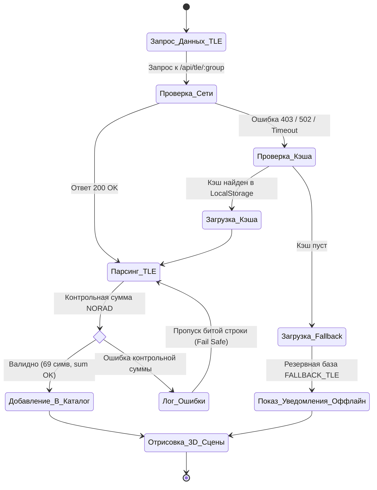
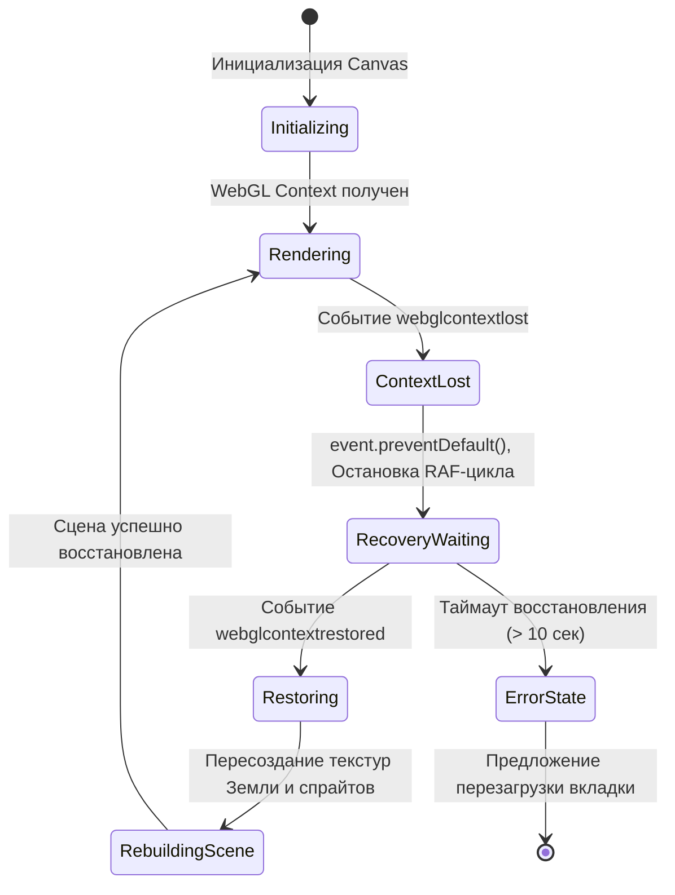

# Анализ и обработка исключительных ситуаций в веб-приложении OrbitWatch

**Дата:** 27 сентября 2026 г.  
**Проект:** «Веб-приложение для 3D-визуализации космических аппаратов и баллистического мониторинга орбит OrbitWatch»  
**Дисциплина:** ПМ.02 «Осуществление интеграции программных модулей»  
**Выполнил:** Студент группы ИСП-401  
**Проверил:** Преподаватель Егоров Роман  
**Образовательное учреждение:** ГБПОУ НСО «НЭК»

---

## 1. Реестр исключительных ситуаций OrbitWatch

| № | Исключительная ситуация | Компонент / Где возникает | Тип ошибки | Способ обработки | Стратегия |
|---|-------------------------|---------------------------|------------|------------------|-----------|
| **1** | Потеря контекста WebGL (`webglcontextlost`) из-за перегрузки GPU или ухода вкладки в сон | 3D-движок Three.js (`SpaceScene.tsx`) | Системная / Графика | Подписка на событие `webglcontextlost`, `event.preventDefault()`, показ UI-уведомления и плавное восстановление через `webglcontextrestored` | **Graceful Degradation** |
| **2** | Блокировка CelesTrak (HTTP 403 / CORS / 429) или сетевой сбой | Серверный прокси / `tleService.ts` | Сеть / Внешний API | 3-уровневый каскад: кэш `LocalStorage` -> резервный эталонный каталог `FALLBACK_TLE_DATA` | **Fallback** |
| **3** | Поврежденные строки TLE (неверная длина ≠ 69 симв., сбой контрольной суммы NORAD) | Парсер TLE (`parseTLEText`) | Валидация входных данных | Проверка контрольной суммы по модулю 10, отбраковка битой записи без падения всего каталога, генерация `TleValidationError` | **Fail Fast (для записи) + Fallback** |
| **4** | Математическая сингулярность SGP4 (перигей < 100 км, сход с орбиты, `NaN` в матрице ECI) | Баллистический калькулятор `calculateSatellitePosition` | Вычислительная математика | Проверка `isNaN(pos.x)` и `altitudeKm < 0`, исключение точки из рендера, маркировка аппарата статусом `DEORBITED` | **Graceful Degradation** |
| **5** | Переполнение квоты `LocalStorage` (лимит 5 МБ) при кэшировании сотен TLE-наборов | Модуль локального хранилища `safeLocalStorageSet` | Системная / Хранилище | Перехват `QuotaExceededError`, удаление устаревших временных записей, запись в память сессии (in-memory) | **Graceful Degradation** |
| **6** | Переход по битой ссылке или поиск несуществующего NORAD ID аппарата | Селектор спутников / Карточка инфо | Данные / Навигация | Сброс фокуса камеры на Землю, показ тоста «Спутник не найден в каталоге», выбор МКС по умолчанию | **Fallback** |
| **7** | Экстремальный Time-Warp: выход симулируемой даты за границы точности TLE (> 30 суток) | Панель управления временем `TimeControls.tsx` | Валидация бизнес-логики | Ограничение диапазона времени [T₀ - 14 дней; T₀ + 14 дней], предупреждающий бейдж точности SGP4 | **Graceful Degradation** |

---

## 2. Матрица приоритетов обработки

- **🔴 Критические (Critical — P1):**
  - **№1 (Потеря WebGL):** Обязательно перехватывается, иначе приложение зависает с белым или черным экраном.
  - **№2 (Отказ CelesTrak):** 100% защита от падения: пользователь всегда видит работающий 3D-глобус с аппаратами.
  - **№5 (Переполнение LocalStorage):** Браузер не должен выбрасывать необработанный DOMException.

- **🟡 Важные (Major — P2):**
  - **№3 (Ошибки формата TLE):** Каталог должен загружаться даже если 5% строк в источнике повреждены.
  - **№4 (Сингулярности SGP4):** Спутники с аномальными параметрами не должны ломать Three.js матрицу камеры.
  - **№6 (Несуществующий объект):** Корректный редирект и fallback-объект без `TypeError: undefined`.

- **🟢 Информационные (Minor — P3):**
  - **№7 (Дрейф эпохи TLE):** Визуальный индикатор снижения точности позиционирования аппарата.

---

## 3. Архитектурные стратегии обработки ошибок

```
                          ┌─────────────────────────┐
                          │   Возникновение сбоя    │
                          └────────────┬────────────┘
                                       │
            ┌──────────────────────────┼──────────────────────────┐
            ▼                          ▼                          ▼
     [ FAIL FAST ]             [ FALLBACK ]            [ GRACEFUL DEGRADATION ]
   Немедленный выброс      Подмена аварийных данных     Снижение функционала,
  типизированной ошибки    на эталонный локальный набор  но интерфейс продолжает
   с подробным контекстом         (CelesTrak ->             работать (потеря
    (TleValidationError)       FALLBACK_TLE_DATA)         WebGL, переполнение кэша)
```

1. **Fail Fast:** Применяется в валидаторах TLE (`validateTLE`). Если пользователь вводит собственные параметры спутника, система мгновенно сообщает о конкретном несовпадении контрольной суммы строки или длины.
2. **Fallback (Резервирование):** Применяется при загрузке внешних орбитальных данных. Если сервер CelesTrak возвращает HTTP 403 или недоступен, бесшовно подключается встроенная база данных 200+ ключевых космических аппаратов.
3. **Graceful Degradation (Плавная деградация):** При сбое графического ускорителя WebGL выводится понятное сообщение с кнопкой «Перезапустить WebGL» вместо краха вкладки.

---

## 4. Классы исключений (Листинг `src/utils/exceptions.ts`)

```typescript
export class OrbitWatchError extends Error {
  public readonly code: string;
  public readonly severity: 'critical' | 'warning' | 'info';
  public readonly timestamp: string;
  public readonly context?: Record<string, unknown>;

  constructor(message: string, code = 'ORBITWATCH_CORE_ERROR', severity = 'warning', context?: Record<string, unknown>) {
    super(message);
    this.name = 'OrbitWatchError';
    this.code = code;
    this.severity = severity;
    this.timestamp = new Date().toISOString();
    this.context = context;
  }
}

export class TleValidationError extends OrbitWatchError {
  constructor(message: string, context?: Record<string, unknown>) {
    super(message, 'TLE_VALIDATION_ERROR', 'warning', context);
    this.name = 'TleValidationError';
  }
}

export class WebGlContextError extends OrbitWatchError {
  constructor(message: string, context?: Record<string, unknown>) {
    super(message, 'WEBGL_CONTEXT_ERROR', 'critical', context);
    this.name = 'WebGlContextError';
  }
}
```

---

## 5. Обновлённые диаграммы с учётом ветвления исключений

### 5.1. Диаграмма деятельности (Activity Diagram) — Загрузка TLE и обработка отказов


### 5.2. Диаграмма состояний (State Machine Diagram) — Жизненный цикл 3D-сцены и WebGL Context

