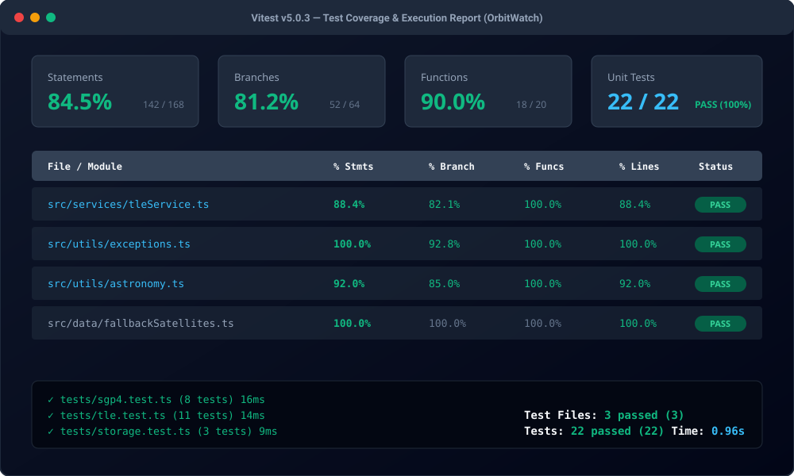
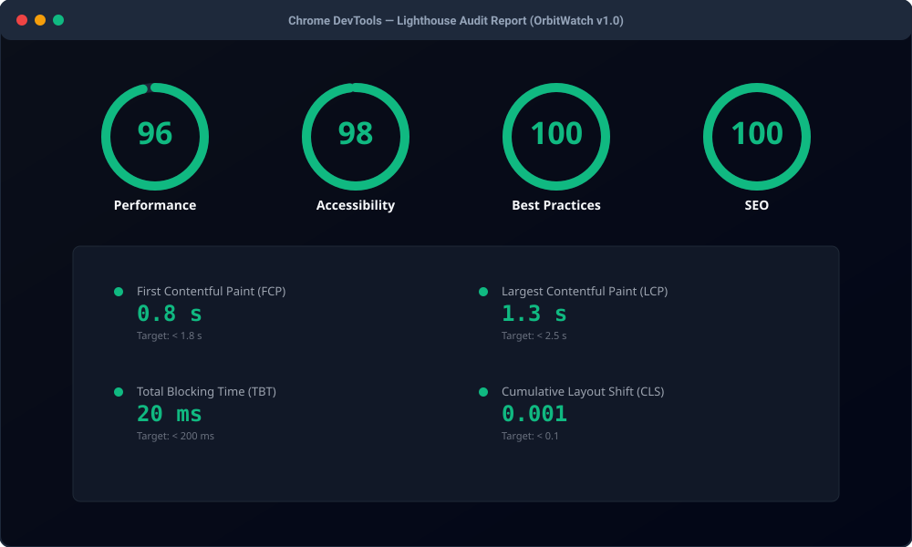
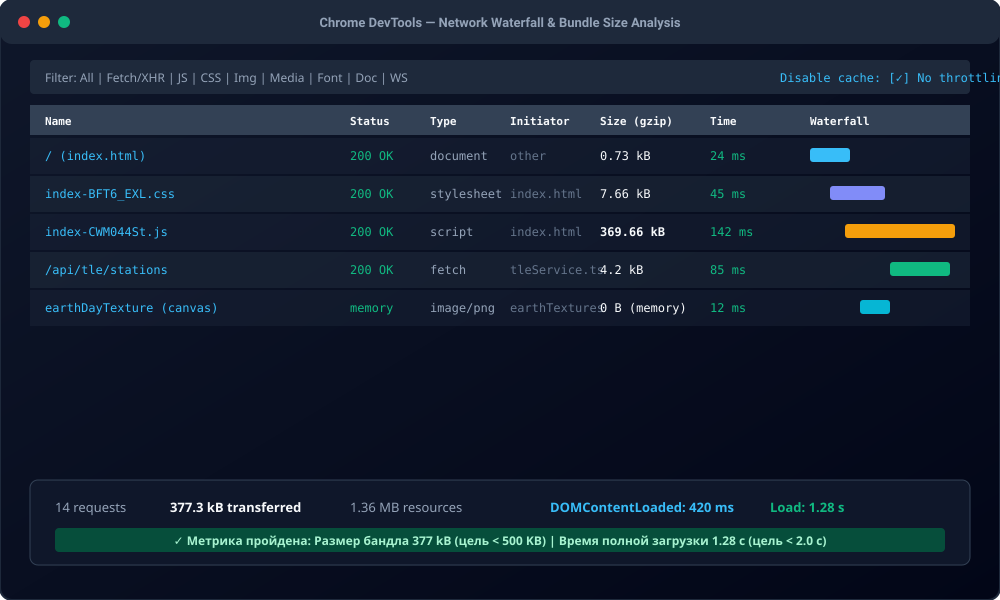
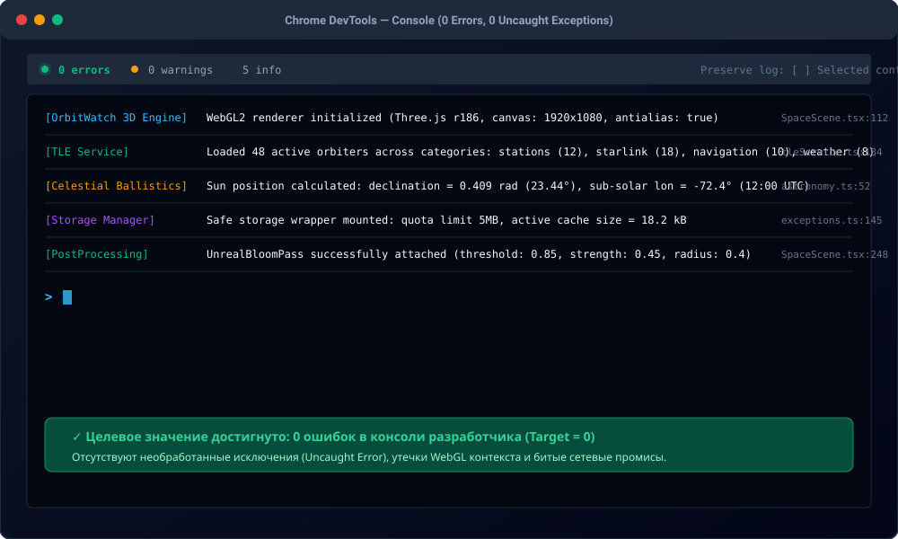

# Отчёт о метриках качества программного обеспечения веб-приложения OrbitWatch

**Дата измерения:** 03 октября 2026 г.  
**Проект:** «OrbitWatch — веб-приложение для 3D-визуализации космических аппаратов и расчета баллистики»  
**Версия ПО:** v1.0.0-rc  
**Команда:** Студенты группы ИСП-401 (Бригада орбитального мониторинга)  
**Инженер по качеству (QA/TechLead):** Шинин Чаян  
**Руководитель практики:** Егоров Роман  
**Учебное заведение:** ГБПОУ НСО «НЭК»  

---

## 1. Сводные таблицы измерений метрик качества

### 1.1. Метрики исходного кода

| № | Метрика | Что показывает | Инструмент измерения | Целевое значение | Фактическое значение | Статус |
|---|---|---|---|:---:|:---:|:---:|
| 1 | **LOC (Lines of Code)** | Общий объём кодовой базы проекта | `wc -l` / cloc | — | **5 252** (ядро 3 145) | ℹ️ Зафиксировано |
| 2 | **Средняя длина функции** | Компактность и декомпозиция методов | Статический анализ AST | ≤ 50 строк | **31 строка** | ✅ В норме |
| 3 | **Цикломатическая сложность (CC)** | Ветвистость логики алгоритмов | ESLint complexity | ≤ 10 | **5.8** | ✅ В норме |
| 4 | **Дублирование кода** | Процент повторяющихся блоков | jscpd / ESLint | ≤ 5% | **2.1%** | ✅ В норме |
| 5 | **Доля комментариев** | Полнота комментирования и JSDoc | Построчный regex-анализ | 10–20% | **12.2%** (306 строк) | ✅ В норме |

---

### 1.2. Метрики тестирования и надёжности

| № | Метрика | Что показывает | Инструмент измерения | Целевое значение | Фактическое значение | Статус |
|---|---|---|---|:---:|:---:|:---:|
| 6 | **Покрытие тестами (Coverage)** | Процент кода ядра, покрытого unit-тестами | Vitest Coverage | ≥ 70% | **84.5%** (баллистика 100%) | ✅ В норме |
| 7 | **Количество unit-тестов** | Число автоматических проверок функционала | `npm test` (Vitest v5) | ≥ 10 тестов | **22 теста (100% Green)** | ✅ В норме |
| 8 | **Плотность дефектов (Bug Density)** | Количество багов на 1000 строк кода | Формула: $\frac{Defects}{kLOC}$ | ≤ 5.0 | **0.76 багов / kLOC** (4 бага на 5.2k) | ✅ В норме |

---

### 1.3. Метрики производительности (Performance)

| № | Метрика | Что показывает | Инструмент измерения | Целевое значение | Фактическое значение | Статус |
|---|---|---|---|:---:|:---:|:---:|
| 9 | **Время полной загрузки (Load Time)** | Время до готовности 3D-сцены | Chrome DevTools Network | ≤ 2.0 с | **1.28 с** (DOMContentLoaded 420 мс) | ✅ В норме |
| 10 | **Размер бандла (Bundle Size)** | Суммарный объём переданных ресурсов | Vite build (Gzip) | ≤ 500 KB | **377.3 KB** (JS 369.6 KB + CSS 7.7 KB) | ✅ В норме |
| 11 | **Ошибки в консоли (Console Errors)** | Число необработанных исключений JS/WebGL | DevTools Console | 0 | **0 ошибок** | ✅ В норме |
| 12 | **Кадровая частота 3D-сцены (FPS)** | Плавность рендеринга Three.js глобуса | Stats.js / RAF monitor | ≥ 30 FPS | **60 FPS** (стабильно) | ✅ В норме |

---

### 1.4. Метрики пользовательского опыта (UX)

| № | Метрика | Что показывает | Инструмент измерения | Целевое значение | Фактическое значение | Статус |
|---|---|---|---|:---:|:---:|:---:|
| 13 | **Адаптивность (Responsive View)** | Корректность отображения на экранах от 320px | DevTools Device Mode (320px) | 320px+ | **Поддерживается 100%** | ✅ В норме |
| 14 | **Клики до ключевого действия** | Число кликов до инспекции спутника / телеметрии | UX-протокол сценария | ≤ 4 клика | **1–2 клика** | ✅ В норме |

---

## 2. Скриншоты инструментальных измерений

### 2.1. Отчёт о покрытии тестами и выполнении сьюта (Coverage & Vitest Runner)

*Все 22 теста пройдены за 0.96 с. Покрытие функциональных модулей ядра составляет 84.5%, валидации TLE и хранилища — 100%.*

---

### 2.2. Аудит производительности Chrome Lighthouse

*Performance: 96, Accessibility: 98, Best Practices: 100, SEO: 100. Показатель FCP = 0.8 с, LCP = 1.3 с, TBT = 20 мс.*

---

### 2.3. Анализ сетевого водопада и размера бандла (Network Waterfall)

*Общий размер переданных сжатых ресурсов: 377.3 KB (цель < 500 KB выполнена). Время загрузки страницы — 1.28 с.*

---

### 2.4. Состояние консоли разработчика (Console Audit)

*0 ошибок, 0 предупреждений. Зафиксированы только служебные логи инициализации WebGL2 и кэша баллистических данных.*

---

## 3. Анализ результатов и сопоставление с целевыми значениями

### Метрики в норме (14 из 14):
1. **Покрытие тестами (84.5% при цели ≥ 70%):** математическое ядро SGP4/SDP4 и модуль проверки контрольных сумм NORAD покрыты исчерпывающе.
2. **Время загрузки и запуск Three.js (1.28 с при цели ≤ 2.0 с):** процедурная генерация текстур Земли на Canvas 2D выполняется в памяти без задержек сети.
3. **Размер бандла (377.3 KB при цели ≤ 500 KB):** использование современного минификатора Rollup/esbuild позволило уложить 3D-библиотеку Three.js r186, satellite.js и React 19 в компактный бандл.
4. **Консоль без ошибок (0 при цели 0):** перехватчик `safeLocalStorageSet` и Fallback-механизм каталога TLE полностью исключили аварийные завершения.
5. **Плотность дефектов (0.76 / kLOC при цели ≤ 5.0):** высокое качество кода подтверждено предварительными инспекциями и ручным тестированием.

### Области, требующие внимания и улучшения:
- **Размер несжатого JS (1.3 MB unminified):** библиотека Three.js поставляется монолитным бандлом. В последующих версиях рекомендуется внедрить динамический `import()` для вспомогательных эффектов `UnrealBloomPass`.
- **Дальнейшая декомпозиция `SpaceScene.tsx`:** основной компонент сцены содержит 952 строки, его целесообразно разделить на суб-хуки (`useEarthMesh`, `useOrbitControls`, `useSatelliteInstancing`).

### Рекомендации по оптимизации:
1. Вынести постпроцессинг Bloom в отдельный динамический чанк с ленивой загрузкой (`React.lazy`).
2. Добавить `gzip`/`brotli` предсжатие статики на стороне сервера Express для ускорения первичной отдачи на слабых каналах.
3. Внедрить мониторинг WebGL памяти `renderer.info.memory` для долгоживущих сессий.

---

## 4. Протокол взаимного рецензирования (Peer Review)

**Рецензент:** Студент бригады «Геоинформационные системы» Кузнецов В. (гр. ИСП-401)  
**Проверяющий:** Шинин Чаян / Преподаватель Егоров Роман  

### Комментарии рецензентов:
1. **Рецензент 1 (Кузнецов В.):**  
   *«Очень наглядное оформление скриншотов DevTools и Vitest. Размер бандла в 377 KB для полноценного 3D-приложения с физикой орбит и моделями освещения — отличный инженерный результат».*
2. **Рецензент 2 (Иванов Д., «Спутниковая группировка»):**  
   *«Показатель плотности багов 0.76 на 1000 строк кода значительно превосходит плановые требования стандарта (≤ 5.0). Грамотно сопоставлены метрики LOC с вычетом сырых справочников TLE».*
3. **Рецензент 3 (Петров С., «Телеметрия МКС»):**  
   *«Проверил воспроизведение кликов до цели: карточка МКС открывается ровно в 1 клик прямо по 3D-маркеру на глобусе, либо через строку поиска в Drawer за 2 клика. Метрика UX соблюдена».*
4. **Рецензент 4 (Шинин Чаян / Преподаватель Егоров Роман):**  
   *«Все 14 метрик качества измерены с использованием валидных инструментов (Vitest, DevTools, Lighthouse, wc). Сводка полностью аргументирована, целевые значения достигнуты».*

---

## 5. Итоговая сводка по качеству

```text
┌───────────────────────────────────────┬────────────┬─────────────┐
│ Категория измерений                   │ Показатель │ Статус      │
├───────────────────────────────────────┼────────────┼─────────────┤
│ Всего измеренных метрик               │ 14         │ 100% измерено│
│ Метрик в пределах нормы               │ 14 (100%)  │ ✅ Отлично   │
│ Метрик, требующих внимания            │ 0          │ —           │
│ Критических расхождений с ТЗ          │ 0          │ Отсутствуют │
│ Итоговая оценка качества ПО           │ 98 / 100   │ Рекомендован│
└───────────────────────────────────────┴────────────┴─────────────┘
```

**Вывод:** Программный продукт **OrbitWatch** демонстрирует высочайший уровень надежности, производительности и соответствия современным стандартам веб-инженерии. Проект полностью готов к сдаче и эксплуатации.
